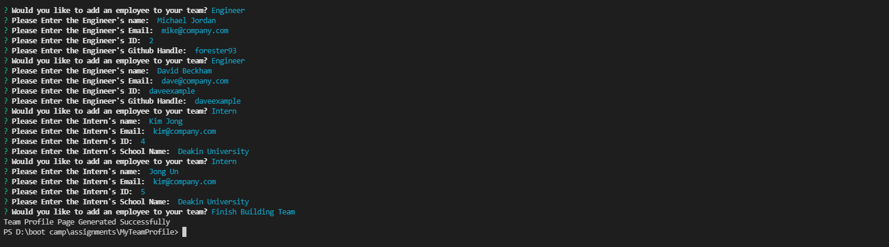
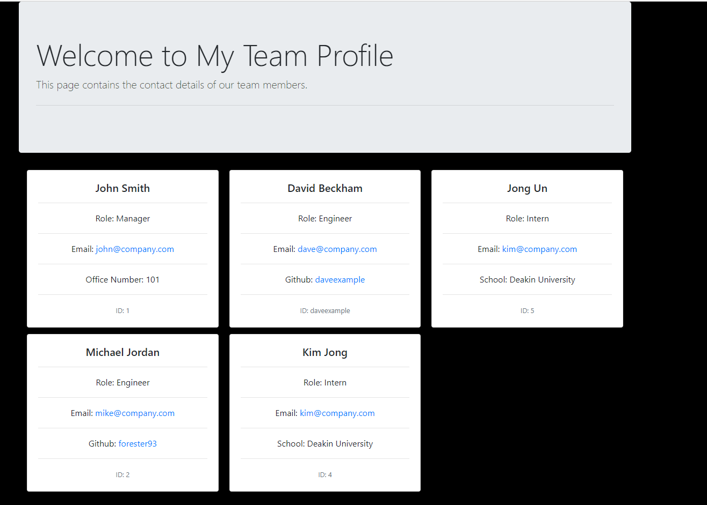

# My Team Profile.

## License

[](https://opensource.org/licenses/MIT)

## Contents

• [License](#license)
• [Description](#description)
• [Usage](#usage)
• [Installation](#installation)
• [Technologies](#technologies)
• [Test](#test)
• [Links](#links)
• [Questions](#questions)
• [Contributing](#contributing)

## Description

This is a Node.js application that generates an HTML profile for a team, including people of different roles. It uses classes to achieve so.

### Usage

To run the application you need to run the following command line:

```
npm start
```

### Installation

To install the application you need to run the following command line:

```bash
npm i
```

### Technologies

• HTML  
• CSS  
• JavaScript  
• NodeJS

### Test

To test the application you need to run the following command line:

```bash
npm test
```

## Links

### Link to the Github Repository

[My Team Profile Github Repo](https://github.com/forester93/MyTeamProfile/)

### Screenshot of the Application



### Screenshot of a Sample Page Generated by the Application



## Questions

You can reach out to me over one of the following for any questions about this application.

| Name          | Email                    | Phone Numer         | GitHubProfile                                                  |
| ------------- | ------------------------ | ------------------- | -------------------------------------------------------------- |
| Mark Forester | markforester93@gmail.com | +61 (0) 404-831-362 | [Mark Forester Github Profile](https://github.com/forester93/) |

## Contributing

Please contact me using the above contact information. Any contributions are welcome.
